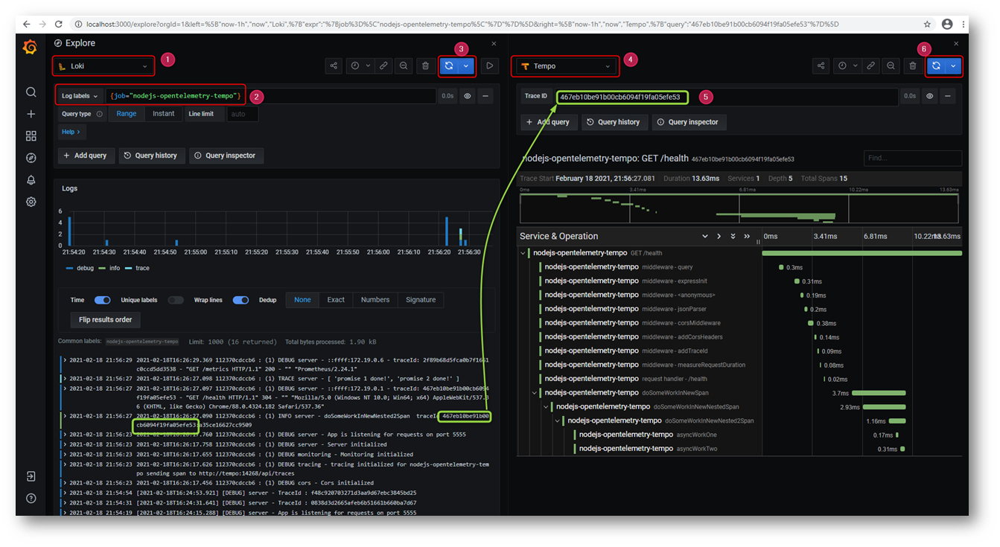
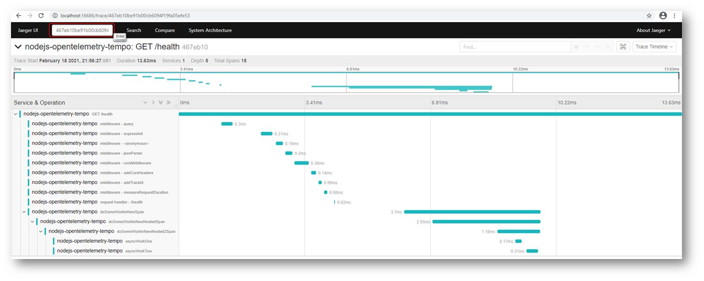
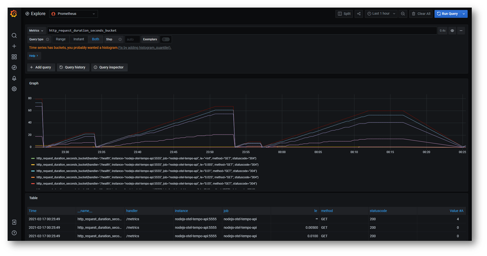

# Project Demonstrating Observability For NodeJs Applications

This is a project demonstrating Observability using :

* [Prometheus](https://prometheus.io/) for monitoring and alerting
* [Loki](https://grafana.com/oss/loki/) for Distributed Logging
* [Tempo](https://grafana.com/oss/tempo/) for Distributed Tracing
* [Grafan](https://grafana.com/) for visualization

And basically integrates the following

* [Opentelemetry](https://opentelemetry.io/)
* [Grafan Tempo](https://grafana.com/oss/tempo/) Which internally uses [Jaeger](https://www.jaegertracing.io/)
* [NodeJs Application](https://nodejs.org/en/)

And basically it demonstrate the best practices for :

* Logging : Using Log4js
* ES6 : Using Babel
* Metrics : Using Promclient
* Seperating configuration
* Containerization 

# Running

## In Docker

````bash
docker-compose up --build
````

Access the endpoint


View the log and trace in grafana




Get the trace information Using Jaeger



View the metrics in prometheus


View prometheus metrics in Grafana




## In Command prompt

Create **.env** in root folder

````
LOG_FILE_NAME=nodejs-opentelemetry-tempo.log
##https://github.com/open-telemetry/opentelemetry-js/blob/v0.16.0/packages/opentelemetry-exporter-jaeger/src/jaeger.ts
OTEL_SERVICE_NAME=nodejs-opentelemetry-tempo
OTEL_EXPORTER_JAEGER_ENDPOINT=http://localhost:14250/api/traces
````

````bash
npm install
````

````bash
npm run dev
````

# Also See

* [Java Opentelemetry Tempo](https://github.com/mnadeem/boot-opentelemetry-tempo)